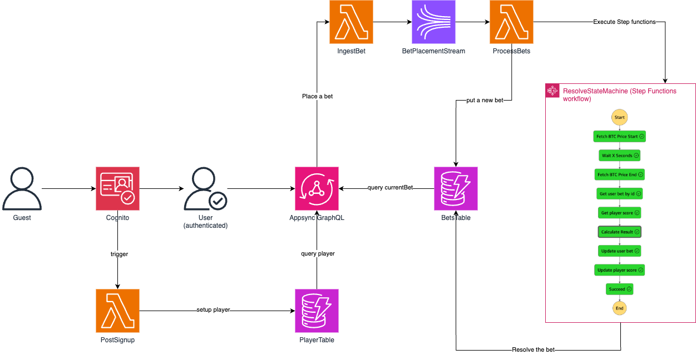

# Simple Bitcoin Bet game

The main goal of this game is to allow players to predict whether the price of Bitcoin will go up or down within a specified time frame, earning or losing points based on the accuracy of their predictions.


## Table of Contents

- [Overview](#overview)
- [Prerequisites](#prerequisites)
- [Installation](#installation)
- [Usage](#usage)
- [Testing](#testing)
- [Architecture](#architecture)

## Prerequisites

Before getting started, ensure you have the following prerequisites:

- Node.js installed (v18.x)
- AWS CDK installed (`npm install -g aws-cdk`)
- AWS CLI configured with appropriate credentials
  - run `cat ~/.aws/credentials` (unix) to see if you have profile configured

## Installation

1. Clone this repository to your local machine.
2. Navigate to the project directory.
3. Install dependencies by running `npm install`.

## Usage

To deploy the AWS infrastructure, run the following command:

```bash
npm run backend:deploy
```

To remove the deployed infrastructure, run:

```bash
npm run backend:destroy
```

To run the frontend SPA

```bash
npm run frontend:serve
```

## Testing

You run the full test suite by

```bash
npm run test
```

Or individually

```bash
npm run backend:test
npm run frontend:test
```

## Architecture

### Backend



The AWS CDK stack defined in `apps/backend/stacks/bitcoin-bet-stack.ts` sets up the following resources:

- DynamoDB tables:
  - `bitcoin-players`: Stores player information including userId, email, and score.
  - `bitcoin-bets`: Stores bet information including userId, guess, prices, and results.
- Cognito userPool: Manages user authentication and registration.
- BetPlacementStream: Kinesis stream for processing bet placements.
- AppSync API (`betsAPI`):
  - GraphQL schema defined in `apps/backend/graphql/schema.graphql`.
  - Data sources connected to DynamoDB tables and Lambda functions.
  - Resolvers to query and mutate data.
- Resolvers:
  - `currentBet.js`: Retrieves the current bet for a user.
  - `placeBet.js`: Handles the placement of a new bet.
  - `player.js`: Retrieves player information.
- Lambdas:
  - `PostSignupLambda`: Triggered after user confirmation to initialize player data.
  - `IngestBetLambda`: Processes incoming bets and puts them into the Kinesis stream.
  - `ProcessBetsLambda`: Processes bets from the Kinesis stream and initiates the resolution workflow.
  - `CalculateResultLambda`: Calculates the result of a bet.
- Step Functions state machine:
  - Orchestrates the bet resolution process:
    1. Fetches initial Bitcoin price
    2. Waits for the specified duration
    3. Fetches final Bitcoin price
    4. Retrieves user bet and player information
    5. Calculates bet result
    6. Updates bet and player data in DynamoDB
- IAM roles and policies: Ensure proper permissions for all components.
- CloudWatch logs: Capture logs from Lambda functions and AppSync API.

### Frontend

- ReactJS: A JavaScript library for building user interfaces
- React Query: A powerful data synchronization library for React applications
- TailwindCSS + ShadcnUI: Utility-first CSS framework with pre-built components
- Vite: A fast build tool and development server

The frontend architecture is structured as follows:

1. **Main Application Entry**:

   - The main entry point is defined in `src/main.tsx`, which sets up the React application with necessary providers.

2. **Routing**:

   - React Router is used for client-side routing, with routes defined in the `App` component.

3. **Authentication**:

   - AWS Amplify is used for authentication, configured in `src/main.tsx`.
   - The `Auth` component (`src/app/components/Auth.tsx`) handles user authentication flow.

4. **State Management**:

   - React Query is used for server state management and data fetching.
   - Custom hooks in `src/api/queries.ts` define queries and mutations for interacting with the backend.

5. **Components**:

   - The main dashboard is composed of several components:
     - `ScoreCard`: Displays the user's current score
     - `PricePredictorCard`: Main interface for making price predictions
     - `BetDetailsCard`: Shows details of the user's current or last bet
   - Reusable UI components are located in `src/app/components/shadcn-ui/`

6. **API Communication**:

   - The `src/api/api-client.ts` file contains the logic for making authenticated requests to the backend.

7. **Custom Hooks**:

   - `useLiveBtcPrice`: Manages WebSocket connection for real-time Bitcoin price updates
   - `useCountdown`: Handles countdown logic for betting periods

8. **Styling**:

   - TailwindCSS is used for styling, with custom configurations in `tailwind.config.js`
   - ShadcnUI components are integrated for consistent UI elements

9. **Environment Configuration**:

   - Environment variables are managed through Vite's env system, with types defined in `src/vite-env.d.ts`

10. **Testing**:
    - Unit tests are written using Vitest and React Testing Library
    - Test files are co-located with their respective components

This architecture promotes modularity, reusability, and maintainability while leveraging modern React patterns and libraries for efficient development and performance.
